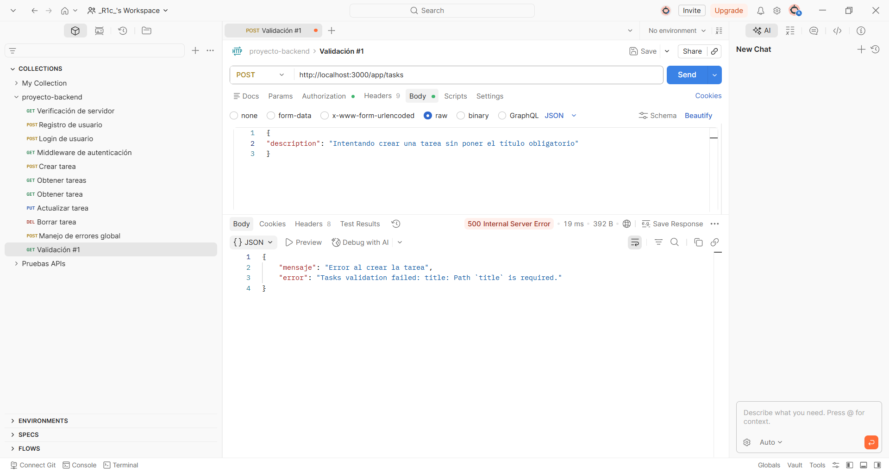
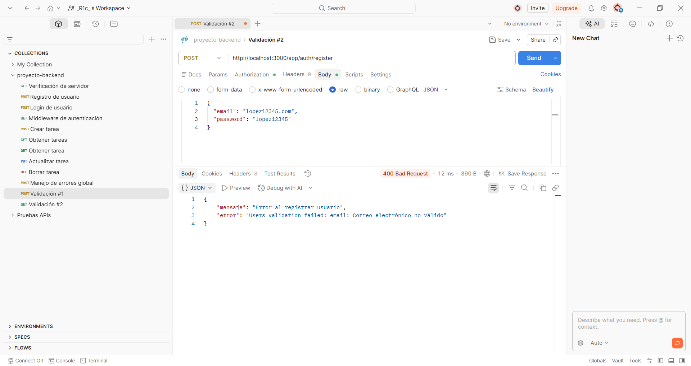
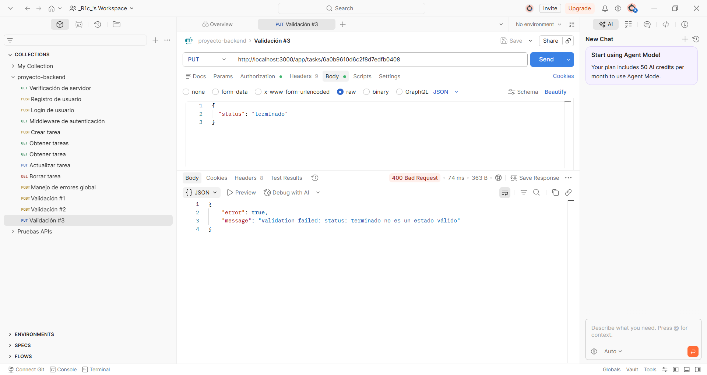

# 🚀 API de Gestión de Tareas (To-Do List)

Este es el proyecto final para el curso de **WEB DEV SERV-SIDE&MICROSER BKE**. Consiste en una aplicación full-stack que permite a los usuarios registrarse, iniciar sesión y gestionar sus entrenamientos personales de manera segura mediante la implementación de una API REST, validaciones estrictas y persistencia de datos.

## 🛠️ Tecnologías Utilizadas

- **Back-End:** Node.js, Express.js, JSON Web Tokens (JWT), Bcrypt.js
- **Base de Datos:** MongoDB (a través de Mongoose)
- **Front-End:** HTML5, CSS3, JavaScript (Vanilla JS)
- **Pruebas de Endpoints:** Postman

## 📁 Estructura del Proyecto

El backend sigue una arquitectura limpia y organizada basada en componentes:

- `/src/config`: Conexión y configuración de la base de datos.
- `/src/controllers`: Lógica de negocio para usuarios y tareas.
- `/src/models`: Esquemas y modelos de datos (Users y Tasks) con validaciones Mongoose.
- `/src/middlewares`: Control de acceso mediante token y manejo global de errores.
- `/src/routes`: Definición de los endpoints de la API.
- `/public`: Interfaz gráfica de usuario (Front-End).

## ⚙️ Requisitos e Instalación

Para ejecutar este proyecto localmente, sigue estos pasos:

1. **Clonar el repositorio:**
   ```bash
   git clone [https://github.com/TU_USUARIO/TU_REPOSITORIO.git](https://github.com/Rica4do-007/proyecto-backend.git)
   cd proyecto-backend

2. **Instalar dependencias:**
    ```bash
    npm install

3. **Configurar las variables de entorno:**
   Crea un archivo .env en la raíz del proyecto y añade tus credenciales:
   ```code snippet 
   PORT=3000
   MONGO_URI=tu_cadena_de_conexion_a_mongodb
   JWT_SECRET=tu_clave_secreta_para_tokens

4. **Iniciar servidor:**
   ```bash
   npm start

## 📸 Evidencia de Pruebas (Postman)

### 1. Validación de Campos Obligatorios (Crear Tarea sin Título)


### 2. Validación de Formato de Email (Registro Erróneo)


### 3. Validación de Valores Permitidos para el Estado (Status)

